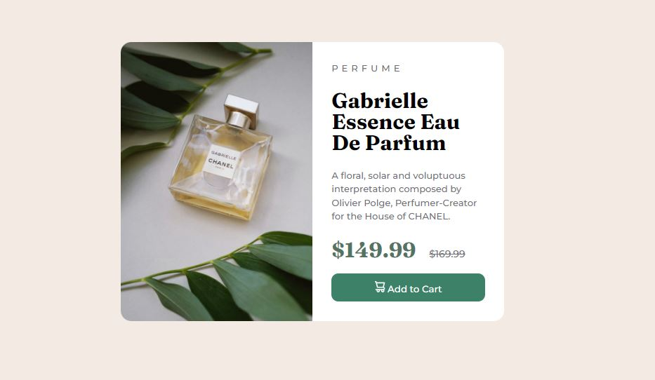

# Product preview card component solution

Esse projeto tem como finalidade criar uma página de apresentação de produto com botão interativo. Estou realizando esse projeto para praticar posicionamento de imagens e container e desenvolvimento de um design responsivo.

## Table of contents

- [O desafio](#o-desafio)
- [Link](#link)
- [Meu resultado](#meu-resultado)
- [Desenvolvido com](#desenvolvido-com)
- [O que aprendi](#o-que-aprendi)
- [Recursos úteis](#recursos-uteis)
- [Autor](#autor)

### O desafio

A proposta do desafio é: 

- Ter uma boa apresentação da página e o usuário conseguir visualizar perfeitamente em desktop ou mobile.
- Ver o estado diferente apresentado no botão com o mouse por cima.

Abaixo imagem proposta pelo desafio:

### Link

Clicando no link abaixo conseguirá ir no deploy do projeto conseguindo interagir com minha solução para esse desafio na versão desktop:

- Deploy do Projeto - [Deploy do Projeto](product-preview-card-component-main-2mw033xdh-boarinilucas.vercel.app)

### Meu resultado

Versão Desktop:

Versão Mobile:

### Desenvolvido com

- Semantic HTML5 markup
- CSS custom properties

### O que aprendi

Com esse projeto consegui melhorar minhas habilidades na responsividade, como manipular melhor imagens e também na criação de variáveis para o arquivo CSS. Outro ponto que me atentei nesse projeto foi começar a adotar os padões de commits.

### Recursos úteis

Para esse projeto utilizei os meios abaixo para estudo e tirar dúvidas:

- W3 Schools: [Add solution URL here](https://www.w3schools.com/)
- Comunidades de programadores no Discord.

## Autor

- Lucas Boarini - [Lucas Boarini](https://github.com/BoariniLucas)